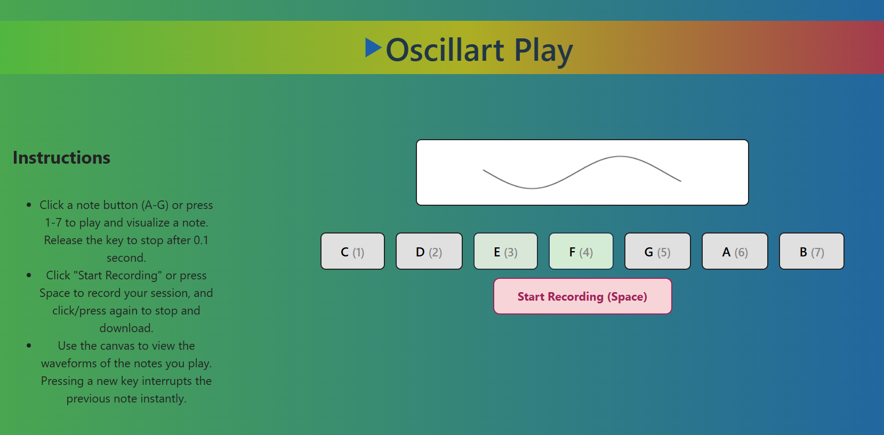

# Oscillart



Oscillart is an interactive web app for visualizing and playing musical notes as animated sine waves. It features a responsive design, keyboard and touch controls, and the ability to record both the audio and the canvas animation. I learnt how to do it from the https://oscillart.athena.hackclub.com and could make this amazing website: https://sadikshyabashyal.github.io/Oscillart-Play

## Features
- Interactive sine wave visualization for musical notes (C, D, E, F, G, A, B)
- Play notes using on-screen buttons or keyboard (1-7)
- Animated, flowing waveforms synchronized with audio
- Start/stop recording of both audio and canvas (video download)
- Responsive and mobile-friendly UI
- Keyboard shortcut for recording (Space bar)
- Instructions panel for user guidance

## How I Set-Upped it?

```bash
npm create vite@latest oscillart-vite -- --template react
cd oscillart-vite
npm install
```
### Installed Packages
- **react** — UI library
- **react-dom** — DOM bindings for React
- **react-router-dom** — Routing for React SPA
- **react-icons** — Icon library for React
- **gh-pages** — For GitHub Pages deployment (dev dependency)

```bash
npm install react-router-dom react-icons
npm install --save-dev gh-pages
```

```json
"scripts":{
   "predeploy": "npm run build",
   "deploy": "gh-pages -d dist"
},
"homepage": "https://sadikshyabashyal.github.io/Oscillart-Play"
```

## Getting Started
Play with the website: "https://sadikshyabashyal.github.io/Oscillart-Play"
### Prerequisites
- Node.js (v16 or later recommended)

### Installation
Want to edit on your own? Grow through the steps:
1. Clone the repository:
   ```bash
   git clone <repo-url>
   cd oscillart-vite
   ```
2. Install dependencies:
   ```bash
   npm install
   ```
3. Start the development server:
   ```bash
   npm run dev
   ```
4. Open your browser and go to `http://localhost:5173` (or the port shown in your terminal).

### Playing Notes
- Click any note button (C, D, E, F, G, A, B) or press keys 1-7 on your keyboard to play and visualize the corresponding note.
- The sine wave animates in the canvas, and the note plays for as long as the key is held (plus a short release).
- Releasing the key stops the note after 0.5 seconds.
- Pressing a new key interrupts the previous note instantly.

### Recording
- Click the "Start Recording (Space)" button or press the Space bar to begin recording both the canvas animation and audio.
- Click again or press Space to stop recording. The recording will be downloaded as a `.webm` video file.

### Keyboard Controls
- `1-7`: Play notes C-B
- `Space`: Start/stop recording

## Project Structure
- `src/components/Navbar.jsx` — Top navigation bar
- `src/pages/Landing.jsx` — Main interactive page with canvas, controls, and instructions
- `src/pages/Landing.css` — Responsive styles for the landing page
- `src/App.jsx` — App entry point and routing
- `src/App.css` — Global and responsive styles
- `src/` — Main source code directory
- `public/` — Static assets

## File Hierarchy
```
Guided_Project-Oscillart/
  ├── index.html
  ├── main.js
  ├── oscillart-vite/
  │   ├── eslint.config.js
  │   ├── index.html
  │   ├── package-lock.json
  │   ├── package.json
  │   ├── public/
  │   │   ├── play.svg
  │   │   ├── vite.svg
  │   │   └── weboscillart.png
  │   ├── README.md
  │   ├── src/
  │   │   ├── App.css
  │   │   ├── App.jsx
  │   │   ├── assets/
  │   │   │   └── react.svg
  │   │   ├── components/
  │   │   │   ├── Navbar.css
  │   │   │   └── Navbar.jsx
  │   │   ├── index.css
  │   │   ├── main.jsx
  │   │   ├── pages/
  │   │   │   ├── Landing.css
  │   │   │   └── Landing.jsx
  │   ├── vite.config.js
  ├── README.md
  ├── style.css
```

## Customization
- You can adjust the canvas size, wave animation speed, and note frequencies in the code.
- The color and style of the wave and UI can be customized in the CSS files.

---

**Coded with AI. AI helped me to code along and gave suggestions.**

**Enjoy creating and visualizing music with Oscillart!**
